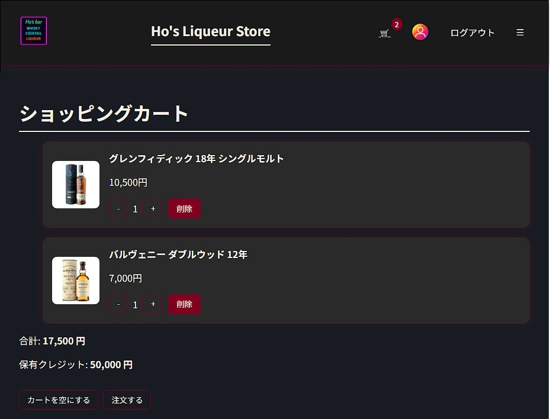

# CartPage 画面定義書
### 📜 概要

- ユーザーがカートに入れた商品を確認し、数量を調整し、注文を完了するページ
- カートに入っている商品リスト、合計金額、保有クレジットを表示
- UserFlow - ユーザーはカートに入っている商品を確認し、数量を調整、削除することができます。 最終的に「注文する」ボタンを押して決済を完了します。
---
### 🔧 主要機能
|機能|説明|
|---|---|
|商品数量調整|「+」「-」ボタンで各商品の数量を調整|
|商品削除|削除ボタンでカートから特定の商品を削除|
|カートを空にする|カートに入っている全ての商品を一度に削除|
|注文する|保有クレジットが合計金額より多い場合、注文を完了。注文完了時にクレジットを差し引き、購入履歴を追加。ログインしていない場合はログインページへ移動|
---
### 📥 主要コンポーネントおよびフック
#### 1. useCart フック
- 役割: カート関連の状態と関数を提供
- 主要機能:
    - `cartItems`: カートに入っている商品配列
    - `increaseQuantity(id)`: 特定の商品の数量を1増やす
    - `decreaseQuantity(id)`: 特定の商品の数量を1減らす
    - `removeFromCart(id)`: 特定の商品をカートから削除
    - `clearCart()`: カートの全ての商品を削除
#### 2. useCredit フック
- 役割: ユーザーのクレジットおよび購入履歴関連の状態と関数を提供
- 主要機能:
    - `credit`: 現在のユーザーの保有クレジット
    - `deductCredit(amount)`: クレジットを差し引く
    - `addPurchase(items, total)`: 購入履歴を追加
#### 3. useAuth フック
- 役割: ユーザー認証関連の状態を提供
- 主要機能:
    - `isLoggedIn`: 現在のログイン状況 (boolean)
#### 4. useNavigate フック (React Router)
- 役割: ページ移動関数を提供
- 主要機能:
    - `navigate(path)`: 指定したパスへ移動
    - 活用: ログインしていないときにログインページへ移動

### 💾 主要変数および役割
|変数名|タイプ|説明|デフォルト値|
|---|---|---|---|
|totalAmount|number|カートに入っている全ての商品合計金額|`cartItems.reduce(...)`|
|canPurchase|boolean|保有クレジットで決済可能かどうか|`totalAmount <= credit`|