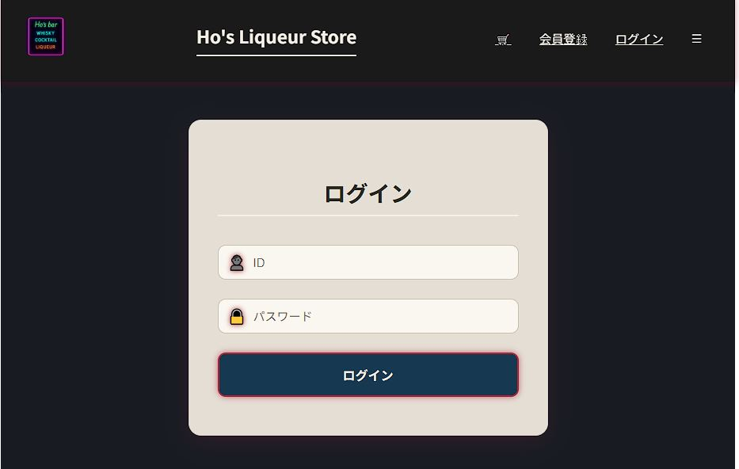

# Login 화면 정의서

### 📜 개요

- 사용자가 아이디와 비밀번호를 입력하여 서비스에 로그인할 수 있는 페이지입니다.
- 인증 성공 시 사용자는 홈 화면으로 이동하며, 실패 시 알림 메시지를 받습니다.

### 🔧 주요 기능
- 아이디 및 비밀번호 입력
- 사용자 인증 및 로그인 처리
- 로그인 성공 시 홈 화면으로 리디렉션

### 📥 주요 컴포넌트 및 훅
- **Login**: 페이지 전체 레이아웃을 담당하는 컨테이너 컴포넌트입니다.
- **LoginForm**: 실제 입력 폼 UI를 렌더링하고 로그인 로직을 처리합니다.
- **useAuth**: 전역 로그인 상태를 업데이트하기 위해 사용됩니다.
- **useNavigate**: 로그인 성공 시 다른 경로로 이동하기 위해 사용됩니다.

### 🔍 handleSubmit( ) (in LoginForm.jsx)
- 입력된 아이디/비밀번호로 `localStorage`의 사용자 정보와 비교하여 인증을 수행합니다.
- **인증 실패 시**: 경고창을 표시합니다.
- **인증 성공 시**:
    1. 전역 상태를 업데이트하고(`AuthContext`), 토큰을 저장합니다.
    2. "로그인 되었습니다." 알림 후 홈 화면(`/`)으로 이동합니다.

### 💾 useState 변수 및 역할 (in LoginForm.jsx)
| 변수 | 설명 |
| :--- | :--- |
| `id` | 사용자가 입력한 아이디 값을 저장합니다. |
| `password` | 사용자가 입력한 비밀번호 값을 저장합니다. |
