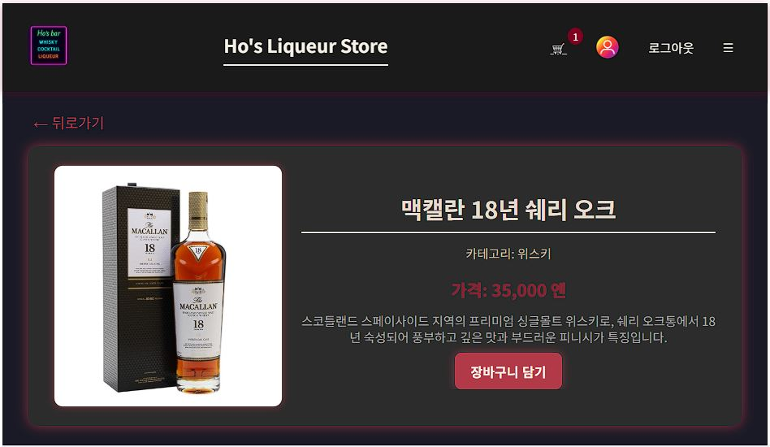

# ProductDetail 画面定義書

### 📜 概要

- URLの製品IDを使用してローカルデータ(`../features/product/ProductData`)から 該当製品の詳細情報を検索して表示する画面です。
- ユーザーは製品情報を確認し、カートに追加することができます。

### 🔧 主要機能
- **製品情報表示**: 製品画像、名前、カテゴリ、価格、説明を画面に表示します。
- **戻る**: ボタンクリック時に前のページへ移動します。
- **カートに追加**: ボタンクリック時に製品がカートに追加され、通知メッセージが出力されます。

### 📥 主要コンポーネントおよびフック
- `ProductDetail` - 製品詳細情報をレンダリングするReact関数型コンポーネント。
- `useParams` - URLから製品`id`パラメータを抽出。
- `useNavigate` - プログラムによるページ移動（戻る）を可能にします。

### 🔍 主要関数
- `useParams()`: URLパスから`:id`のように動的に変化する値を抽出する際に使用するReact Routerフック。例えば、`/products/123`パスから「123」のような製品IDを取得します。
- `useNavigate()`: ページを移動させるための関数を返すReact Routerフック。
- `handleAddToCart()`: 「カートに追加」ボタンクリック時に実行され、製品がカートに追加されたことを知らせる簡単な通知を表示します。