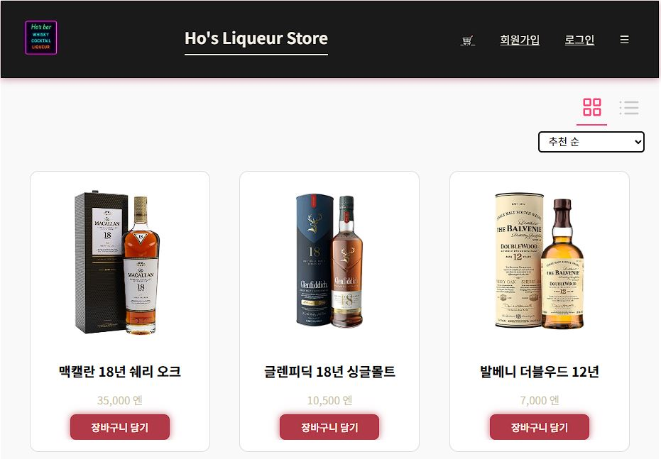

# ProductList 화면 정의서
### 📜 개요

- 쇼핑몰의 상품 목록 페이지로, 상품 목록을 카테고리별 필터링, 정렬, 그리드/리스트 전환할 수 있음
- 각 상품을 클릭하면 상세 페이지로 이동, 장바구니 담기 기능 제공(주문시에는 로그인 필요.)
- UserFlow - 사용자는 카테고리를 선택하고, 원하는 정렬방식을 선택하여  상품을 탐색한 뒤 장바구니에 담거나 상세 페이지로 이동한다.
---
<!--
| 이름 | 설명 |
|------|------|
| 홈 화면 | 사용자가 처음 보는 화면입니다. 주요 제품이 노출됩니다. |}
-->
### 🔧 주요 기능
|기능|설명|
|---|-------|
|카테고리 필터링|selectedCategory를 기반으로 상품 목록 필터링 (전체, 위스키, 전통주, 리큐르)|
|상품 정렬	|추천 순, 가나다 순, 가격 낮은순, 가격 높은순 정렬 가능|
|뷰 전환	|그리드 보기 ↔ 리스트 보기 전환 버튼|
|상품 상세 이동|	상품 클릭 시 /product/:id 페이지로 이동|
|장바구니 담기	|버튼 클릭 시 해당 상품을 장바구니에 추가 (useCart)|
---
### 📥 주요 컴포넌트 및 훅
#### 1. ProductList 컴포넌트
- 역할: 상품 리스트를 그리드 또는 리스트 형태로 렌더링
- 주요 props:
    - products : 렌더링할 상품 배열
    - onAddToCart : 장바구니 추가 함수
    - onViewDetails : 상품 상세 보기 함수
<!---
#### 2. useAuth 훅
- 역할: 로그인 상태를 확인하여 사용자 인증 관련 상태를 제공
- 주요 기능:
- isLoggedIn : 현재 로그인 여부 (boolean)--->
#### 2. useCart 훅
- 역할: 장바구니 상태 및 함수 제공
- 주요 기능:
    - addToCart(product) : 장바구니에 상품 추가 함수
    - 활용: 장바구니 담기 버튼 클릭 시 호출
#### 3. useNavigate 훅 (React Router)
- 역할: 페이지 이동 함수 제공
- 주요 기능:
    - navigate(path) : 지정한 경로로 이동
    - 활용:
    - 상품 상세 페이지 이동 시 사용
#### 4. productsData
- 역할: 전체 상품 목록 데이터 배열
- 구성: 각 상품은 id, name, price, image, category를 포함

### 💾 useState 변수 및 역할
|변수명|타입|설명|기본값|
|---|---|---|---|
|isGrid|boolean|그리드 뷰 활성화 여부(true면 그리드, false면 리스트)|true|
|sortType|string|상품 정렬 방식 (default, alphabet, priceAsc, priceDesc)|'default'|