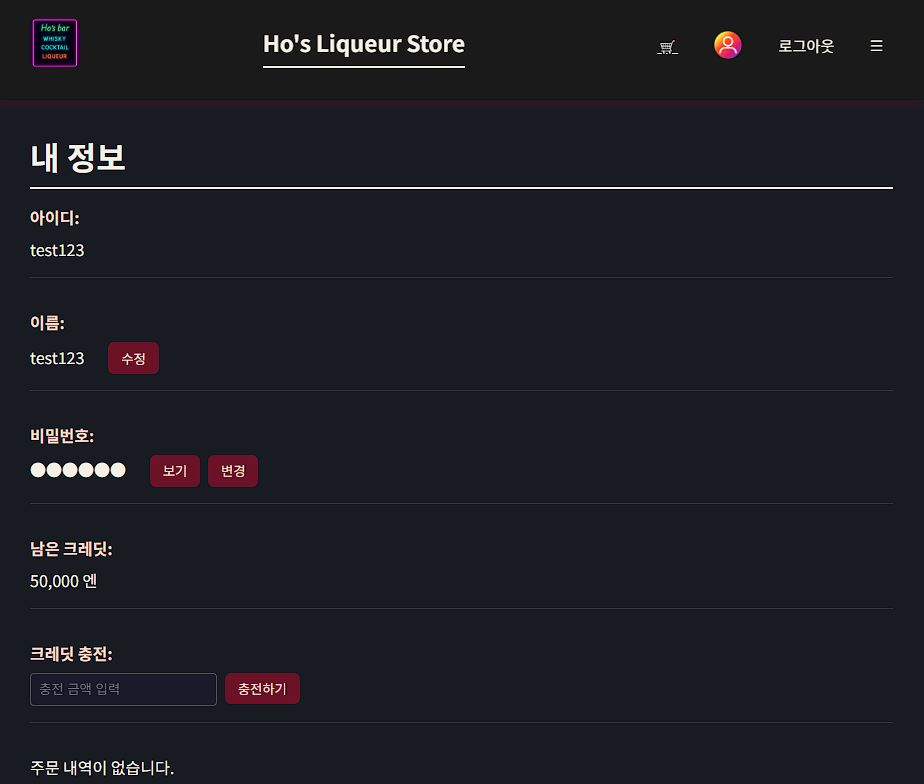

# Profile 画面定義書
### 📜 概要

- ユーザー情報を照会・修正し、クレジットをチャージし、購入履歴を確認できるページです。
- ログインしているユーザーのみアクセス可能です。

### 🔧 主要機能
- ユーザーID表示
- ユーザー名修正機能
- ユーザーパスワード変更機能（有効性検証を含む）
- 現在のクレジット残高表示
- クレジットチャージ機能
- 購入履歴照会 (PurchaseHistory コンポーネントを使用)

### 📥 主要コンポーネントおよびフック
- ProfilePage - ページ全体のロジックを担当するコンテナコンポーネント
- PurchaseHistory - ユーザーの購入履歴を表示するコンポーネント
- useAuth - ユーザー認証情報 (currentUser, logout, updateUser) 管理
- useCredit - ユーザークレジット情報 (credit, chargeCredit) 管理
- useState - コンポーネントの状態管理 (名前修正、パスワード変更、クレジットチャージなど)

### 🔍 主要関数
- **handleNameUpdate()**: 名前の有効性検証後、localStorage および UI を更新。
- **handlePasswordUpdate()**: パスワードの有効性検証および確認後、localStorage および context を更新。
- **updateUserInStorage(updatedUser)**: localStorage のユーザー情報を更新。
- **handleCharge()**: チャージ金額の有効性検証後、クレジットチャージおよび UI を更新。

### 💾 useState 変数および役割
|変数|説明|
|---|---|
|isEditingName|名前修正モードの有効/無効 (boolean)|
|newName|修正する新しい名前の入力値|
|isEditingPassword|パスワード変更モードの有効/無効 (boolean)|
|newPassword|変更する新しいパスワードの入力値|
|showPassword|パスワード表示/非表示トグル (boolean)|
|chargeAmount|クレジットチャージ金額の入力値|

### validate( ) 関数の有効性検証基準 (handlePasswordUpdate 関数内)
|項目|条件|正規表現|
|---|---|---|
|パスワード|英字+数字+特殊文字を含む8～20文字|`passwordRegex = /^(?=.*[A-Za-z])(?=.*\d)(?=.*[@$!%*#?&])[A-Za-z\d@$!%*#?&]{8,20}$/;`|
|名前|空白であってはならない|`!newName.trim()`|
|チャージ金額|数値であり0より大きいこと|`isNaN(amount) || amount <= 0`|