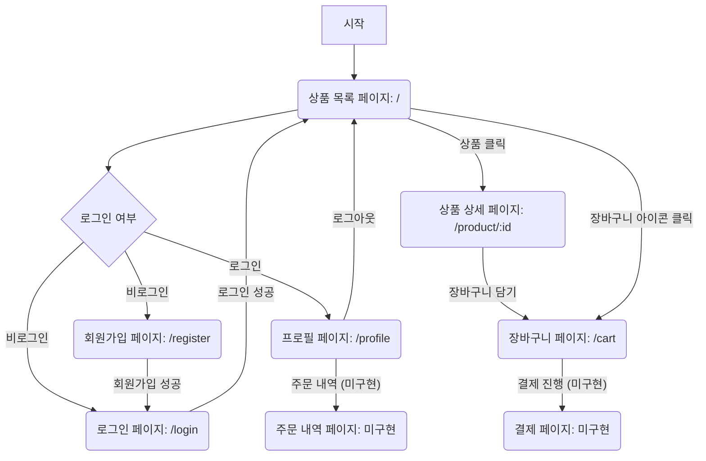

```mermaid
graph TD
    A[시작] --> B(상품 목록 페이지: /);

    B --> C{로그인 여부};
    C -- 비로그인 --> D(로그인 페이지: /login);
    C -- 비로그인 --> E(회원가입 페이지: /register);
    D -- 로그인 성공 --> B;
    E -- 회원가입 성공 --> D;

    B -- 상품 클릭 --> F(상품 상세 페이지: /product/:id);
    F -- 장바구니 담기 --> G(장바구니 페이지: /cart);
    B -- 장바구니 아이콘 클릭 --> G;

    C -- 로그인 --> H(프로필 페이지: /profile);
    H -- 로그아웃 --> B;

    G -- 결제 진행 (미구현) --> I(결제 페이지: 미구현);
    H -- 주문 내역 (미구현) --> J(주문 내역 페이지: 미구현);
```