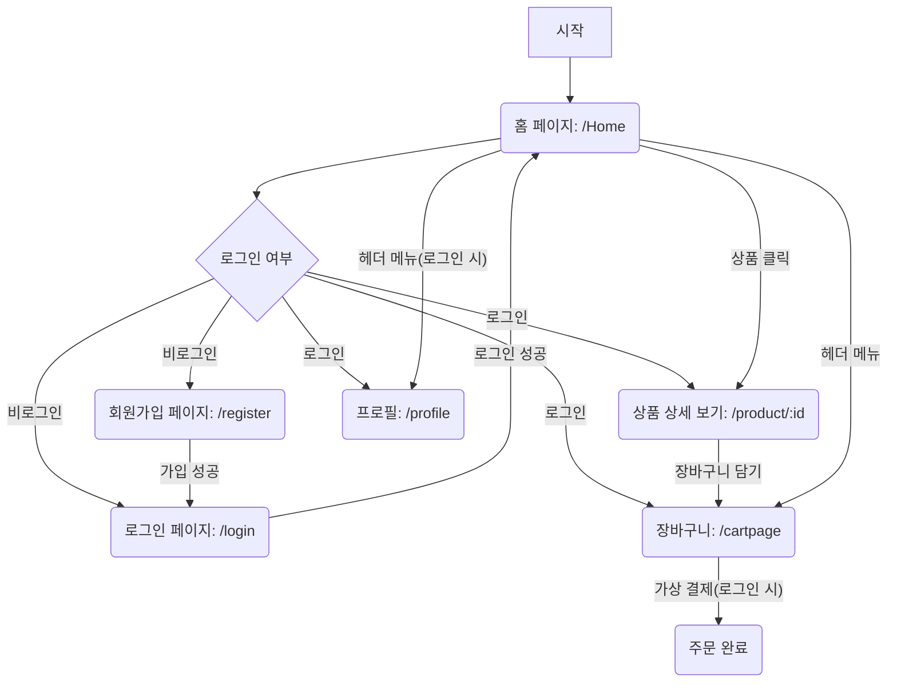

```mermaid
flowchart TD
    A[시작] --> B(홈 페이지: /Home);
    B --> C{로그인 여부};

    C -- 비로그인 --> D(로그인 페이지: /login);
    C -- 비로그인 --> E(회원가입 페이지: /register);
    D -- 로그인 성공 --> B;
    E -- 가입 성공 --> D;

    C -- 로그인 --> F(상품 상세 보기: /product/:id);
    C -- 로그인 --> G(장바구니: /cartpage);
    C -- 로그인 --> H(프로필: /profile);

    B -- 상품 클릭 --> F;
    F -- 장바구니 담기 --> G;
    B -- 헤더 메뉴 --> G;
    B -- 헤더 메뉴(로그인 시) --> H;
    G -- 가상 결제(로그인 시) --> I(주문 완료);
```